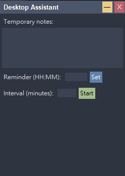
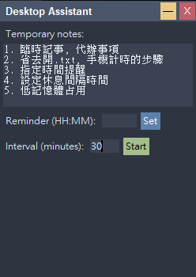

## 桌面小助手
懶得開文字文件臨時記事? 懶得用手機計時? 那麼桌面小助手適合您:

1. 臨時記事，代辦事項(關閉後不回儲存)
2. 指定時間提醒
3. 設定休息間隔時間提醒
4. 低資源占用，簡單易用





## Windows x64
直接執行 
```
floating_widget.exe
```

## Linux
直接執行 
```
floating_widget
```

## 或執行 Python
```
python floating_widget.py
```

簡單辦公桌面小物，希望喜歡